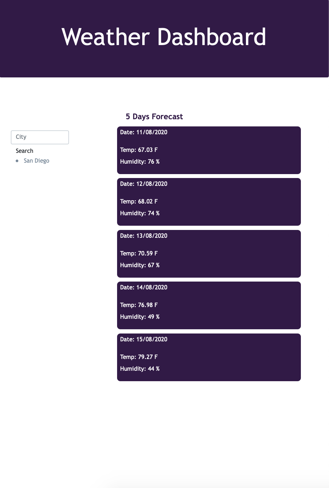

# Project Title

Weather Dashboard

## Motivation

Simple Weather Dashboard created to have a quick weather result.

## Style

HTML, CSS, and JS.

## Credits
Some tutorials used:
* https://www.youtube.com/watch?v=ecT42O6I_WI
* https://www.youtube.com/watch?v=KqZGuzrY9D4
* https://www.youtube.com/watch?v=wPElVpR1rwA
* https://www.youtube.com/watch?v=4UoUqnjUC2c

## Project GitHub Repo

<a href="https://github.com/taliavazquez/weather-dashboard"><bold>Repo</bold></a>

## Project Website

<a href="https://taliavazquez.github.io/weather-dashboard/"><bold>DEMPLOYED SITE</bold></a>

© 2020 Talia Vazquez
